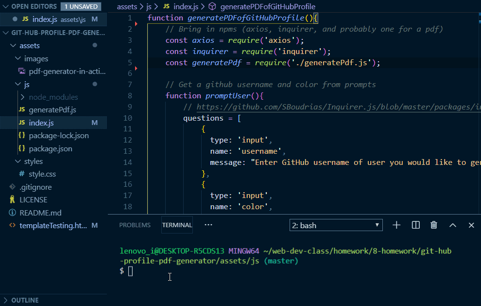

# git-hub-profile-pdf-generator

## Description 
This project has the user input a GitHub username and a color into node.js. It then generates a PDF resume utilizing information from the github api based on the username and utilizies the user input color for styling. The code is taking values from the github api and placing them within an html template, which is converted into a PDF.

## Images
GIF of app working:

## Installation 
Keep all files in a single folder and do not move files around within the folder. You must also have node.js and perform a ndm install to bring in all the necessary node modules.

## Usage 
This was primarily made to meet the requirements of a homework assignment. You could use this to as the basis of how to generate a PDF using html, or could modify it to create a better resume generated from GitHub data.

## Credits 
I created this code based on the homework prompt created by Triology Education Services. Certain pieces of code I used online resources for help. I have included citations in the form of comments throughout the html and css. I used GitHub user bcbrian's repo https://github.com/bcbrian/html-to-pdf to learn how to create a PDF from HTML using the npm electron-html-to https://www.npmjs.com/package/electron-html-to. Big thanks to cockos incorporated for their wizardy of LICEcap to create my gif https://www.cockos.com/licecap/.

## Contributing 
I was the only one to work on this project, but of course I had help from my instructor, TA's, and classmates.

## Challenges
Had some serious struggles with getting my styling colors to display. Learned that another classmate was having no issue who used the provided CSS. I figured out that it has something to do with setting the body project for background-color to white and adding -webkit-print-color adjust:exact !important;. I struggled with deciding how to organize my code so it wasn't one giant mess. I decided to split it into 2 files. It still isn't great, but it's better than one giant muess of code. I experienced some frustration with learning how to use module.exports, but it was my first time using it outside of class activities. I also made silly mistakes like leaving the PDF from the last run of the code open causing my next test to fail do to the code not being able to access the opened file." 

## License
[MIT](https://choosealicense.com/licenses/mit/)

